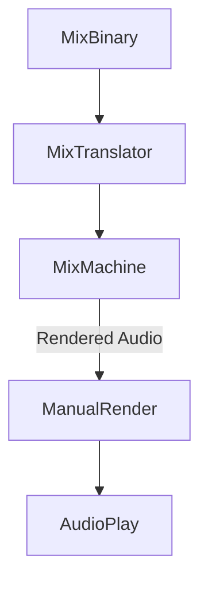

Defines the process of audio.

The process of audio rendering can be categorized into three main types: [[PreRender]], [[RealTime_Render]], and [[ManualRender]].

- **[[PreRender]]** refers to pre-processed audio rendering done before playback.
- **[[RealTime_Render]]** processes audio in real-time during playback, adapting dynamically to changes.
- **[[ManualRender]]** is a specialized rendering mode that relies entirely on external manipulation, requiring direct control or mechanical adjustment by actively listening to the audio.
	If you're planning to use this mode for DJing, you must have the skills to perform **beat matching** manually without relying on automated tools.

See [[MixTranslator]], [[MixMachine]] 