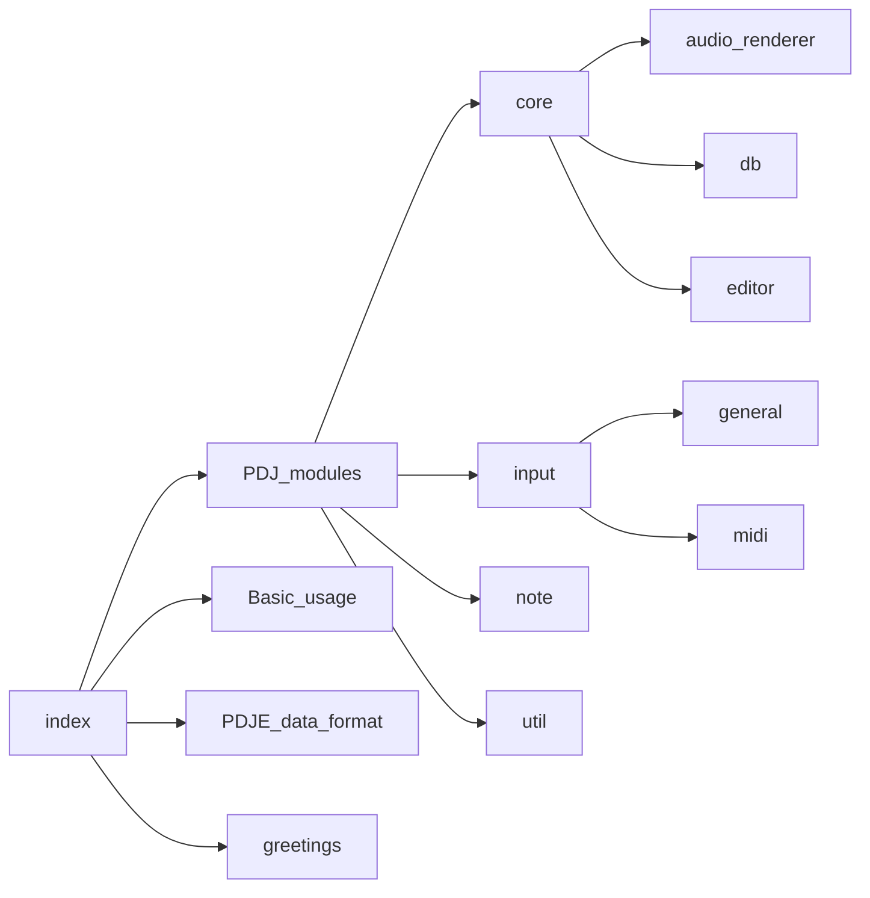
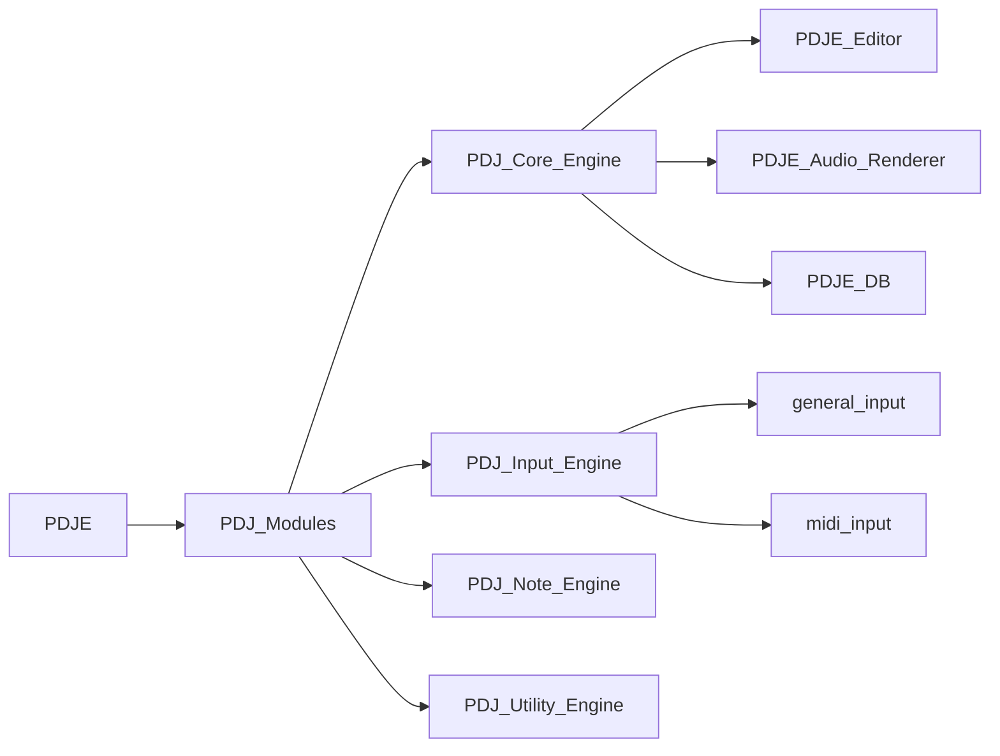

[[PDJE]] - The Rhythm Game Engine + DJ 
	[[Engines]]
	[[Interface]]
		[[DB]]
			[[Music]]
			 [[Track]]
		[[Audio_Render]]
			[[FullPreRender]]
			[[Hybrid Render]]
			[[FullManualRender]]
			[[EffectRender]]
		[[Editor]]
		[[Note_Render]]
		[[Input]]
		

Documentation

