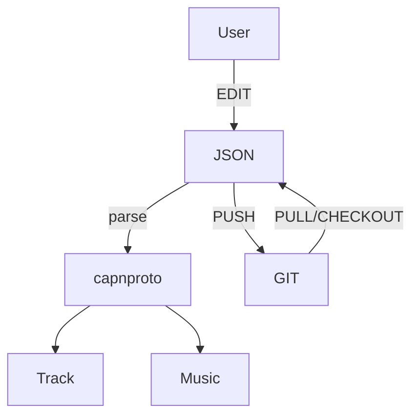
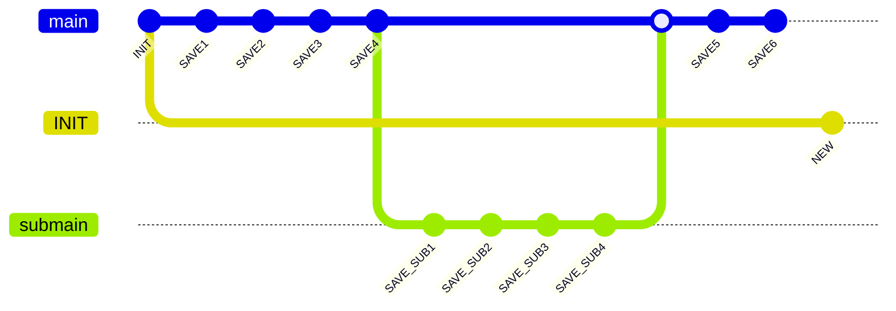
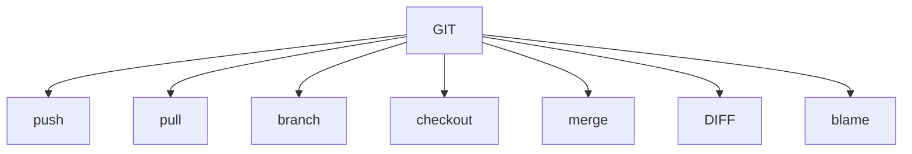

```mermaid
flowchart TD
User -->|EDIT| JSON
JSON -->|parse| capnproto
capnproto --> Track
capnproto --> Music

JSON -->|PUSH| GIT
GIT -->|PULL/CHECKOUT| JSON

```

```mermaid
gitGraph
        commit id: "INIT"
        branch INIT
        checkout main
        commit id:"SAVE1"
        commit id:"SAVE2"
        commit id:"SAVE3"
        commit id:"SAVE4"
        branch submain
        commit id:"SAVE_SUB1"
        commit id:"SAVE_SUB2"
        commit id:"SAVE_SUB3"
        commit id:"SAVE_SUB4"
        checkout main
        merge submain
        
        commit id:"SAVE5"
        commit id:"SAVE6"
        checkout INIT
        
        commit id:"NEW"

```

```mermaid
flowchart TD
GIT --> push
GIT --> pull
GIT --> branch
GIT --> checkout
GIT --> merge
GIT --> DIFF
GIT --> blame
```

