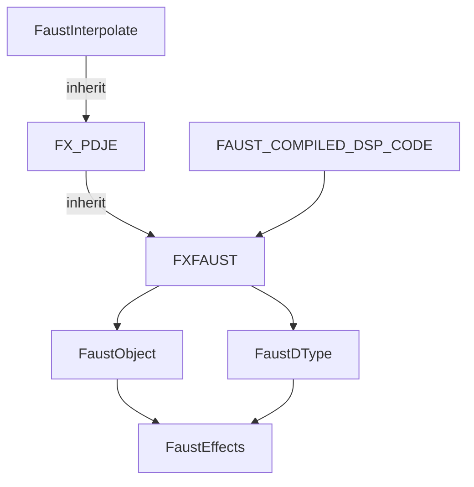

Renders Effects

```mermaid 
flowchart TD
FaustInterpolate -->|inherit| FX_PDJE
FX_PDJE -->|inherit| FXFAUST
FAUST_COMPILED_DSP_CODE --> FXFAUST
FXFAUST --> FaustObject --> FaustEffects
FXFAUST --> FaustDType --> FaustEffects


```
See: [[FaustInterpolate]], [[FX_PDJE]], [[FAUST_COMPILED_DSP_CODE]], [[FXFAUST]], [[FaustObject]], [[FaustDType]], [[FaustEffects]]
Also See: [[Manual Render]]
