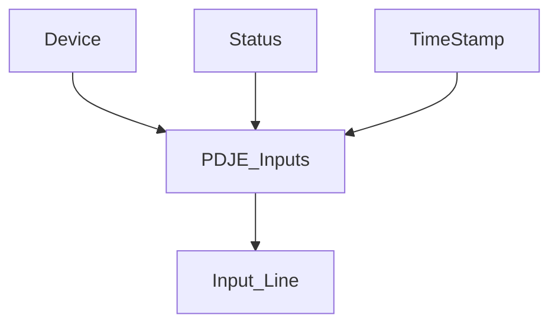
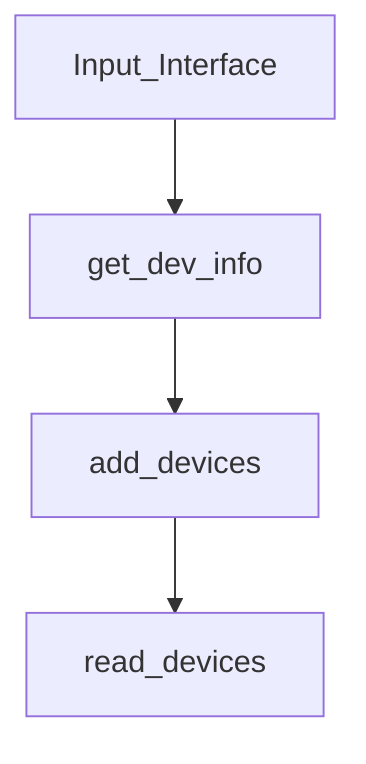
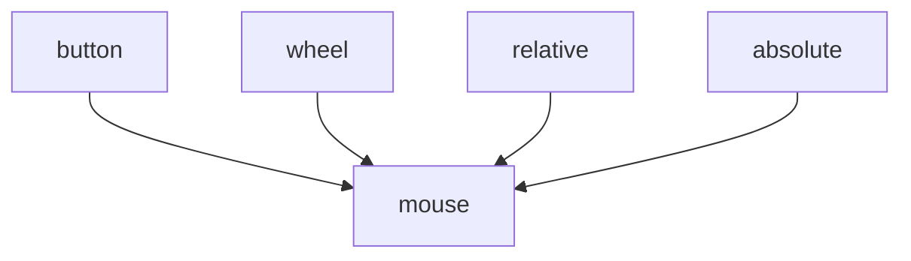
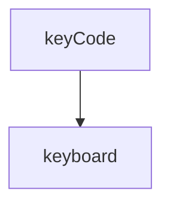

Device

| Name        | Type                  | Event                  |     |
| ----------- | --------------------- | ---------------------- | --- |
| device name | mouse, keyboard, midi | mouse , keyboard ,midi |     |

| 이벤트                            | 필드(필수)                              | 값 범위 / 규칙                        | 비고                                       |
| ------------------------------ | ----------------------------------- | -------------------------------- | ---------------------------------------- |
| Note On                        | channel, note, velocity             | ch 0–15 / note 0–127 / vel 1–127 | **vel=0인 Note On = Note Off**로 취급        |
| Note Off                       | channel, note, velocity             | ch 0–15 / note 0–127 / vel 0–127 | 릴리즈 속도(velocity)는 장치에 따라 0 고정일 수 있음      |
| Poly Aftertouch (Key Pressure) | channel, note, pressure             | 0–127                            | **개별 키**에 대한 지속 압력                       |
| Channel Aftertouch             | channel, pressure                   | 0–127                            | 채널 전체에 대한 압력                             |
| Control Change (CC)            | channel, controller, value          | ctrl 0–127 / val 0–127           | 예: **CC1 Mod**, **CC64 Sustain**(≥64=ON) |
| CC(14-bit) 결합                  | channel, controllerMSB/LSB, value14 | (0–31)+32~63 결합 → 0–16383        | MSB(0–31)와 LSB(32–63) 쌍                  |
| Program Change                 | channel, program                    | 0–127                            | (선택) **Bank Select**: CC0/32 후 Program   |
| Pitch Bend                     | channel, value14                    | 0–16383, **센터=8192**             | 정규화: `norm = (value14-8192)/8192.0`      |
| (옵션) Clock/Start/Stop          | –                                   | 실시간 동기                           | 연주/동기 처리용, 키 입력과 분리해도 됨                  |
