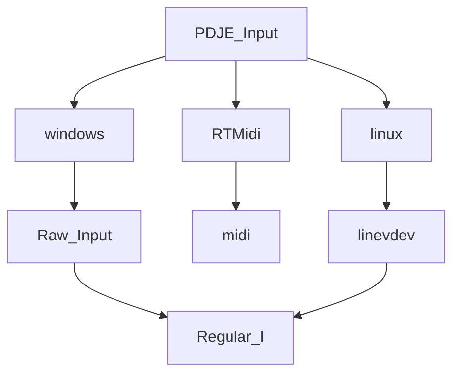
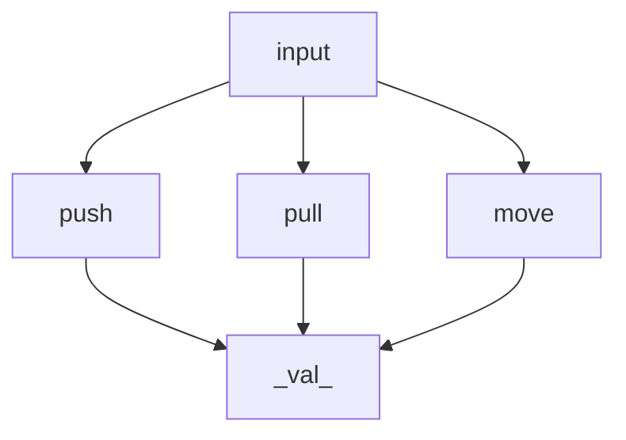
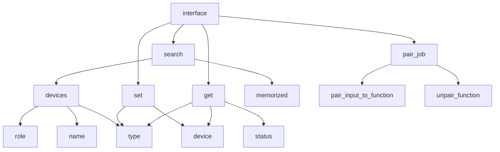

Treat input as a minimum delay.

Windows: Raw Input
Linux: [[EVDEV]]
MAC OS: IO KIT

There's an implementation of each one, and it supports the cross platform.

all applications are satisfied with update frames less than 1 ms.

Also, they all use the interactive method.

