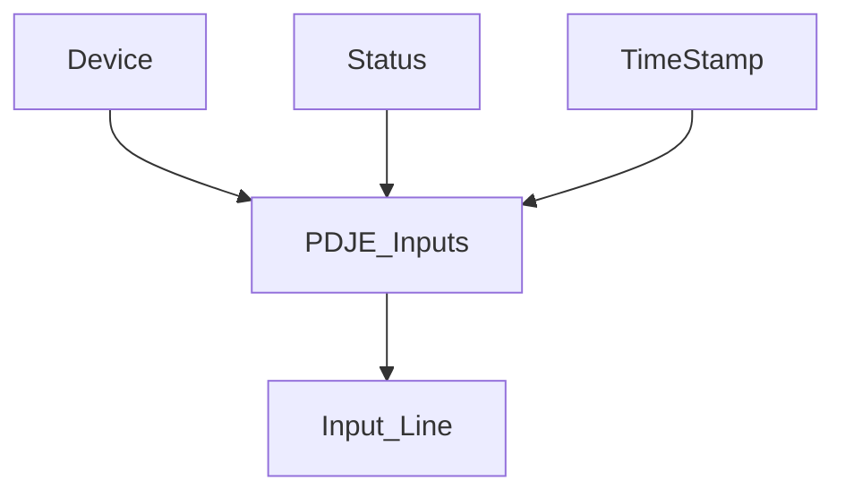
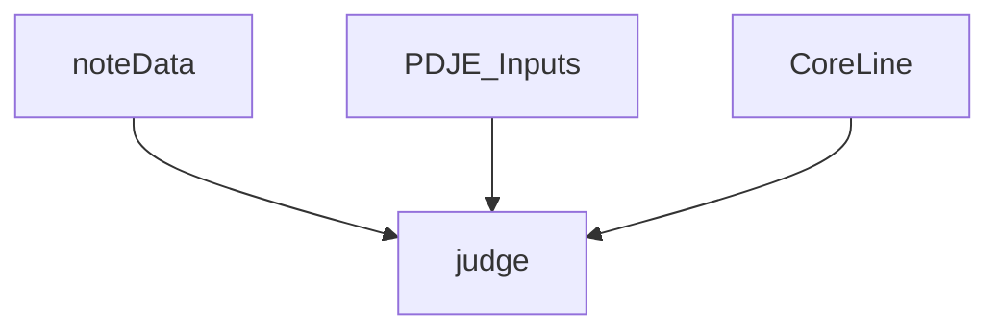
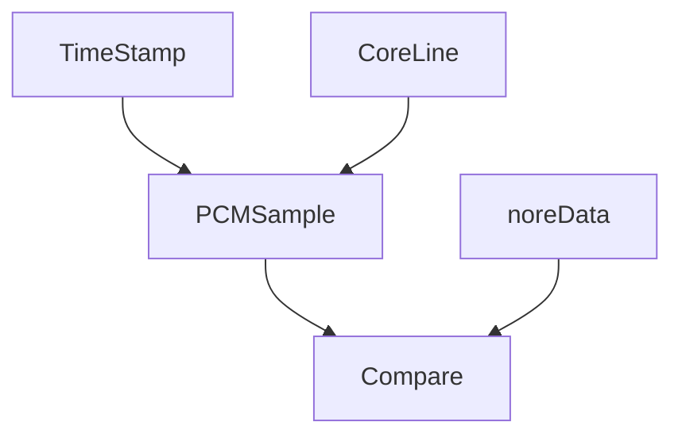

```mermaid
flowchart TD

Device --> PDJE_Inputs
Status --> PDJE_Inputs
TimeStamp --> PDJE_Inputs

PDJE_Inputs --> Input_Line


```

```mermaid
flowchart TD

noteData --> judge
PDJE_Inputs --> judge
CoreLine --> judge

```

```mermaid
flowchart TD
TimeStamp --> PCMSample
CoreLine --> PCMSample

PCMSample --> Compare
noreData --> Compare

```

