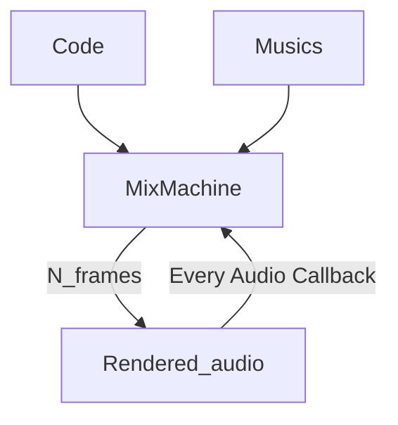
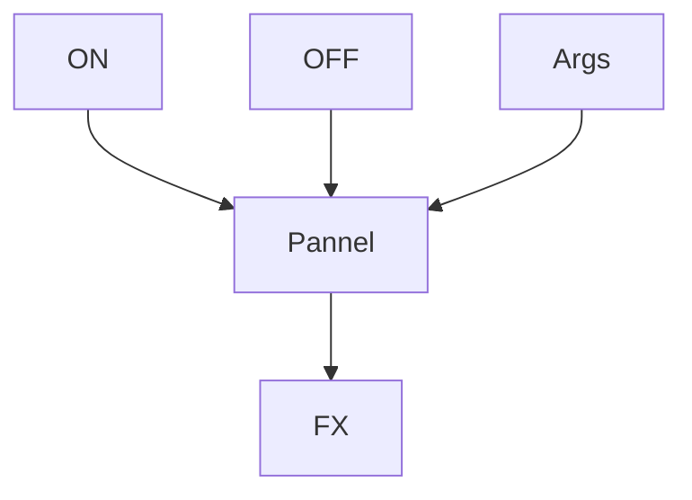

In **[[RealTime_Render]]**, you can think of it as bypassing **[[MixBinary]]** and **[[MixTranslator]]**, directly manipulating their roles through code.

However, since full control is handed over to the user, **frame-perfect** precision is no longer guaranteed.

See: [[MixMachine]]