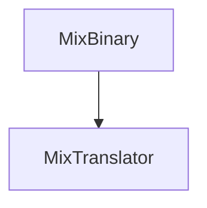

music mixing file. implemented with [[CapNP3roto]]

| [[type]]      | [[details]]     | [[ID]] | [[first]] | [[second]] | [[third]] | [[bar]] | [[beat]] | [[separate]] | [[Ebar]] | [[Ebeat]] | [[Eseparate]] |
| ------------- | --------------- | ------ | --------- | ---------- | --------- | ------- | -------- | ------------ | -------- | --------- | ------------- |
| [[TYPE_ENUM]] | [[DETAIL_ENUM]] | int    | TEXT      | TEXT       | TEXT      | long    | long     | long         | long     | long      | long          |

See: [[MixTranslator]]