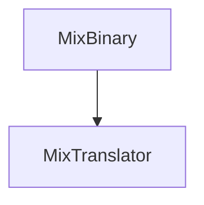

music mixing file. implemented with [[CapNProto]]

| [[type]]      | [[details]]     | [[ID]] | [[first]] | [[second]] | [[third]] | [[bar]] | [[beat]] | [[separate]] | [[Ebar]] | [[Ebeat]] | [[Eseparate]] |
| ------------- | --------------- | ------ | --------- | ---------- | --------- | ------- | -------- | ------------ | -------- | --------- | ------------- |
| [[TYPE_ENUM]] | [[DETAIL_ENUM]] | int    | TEXT      | TEXT       | TEXT      | long    | long     | long         | long     | long      | long          |

See: [[MixTranslator]]

| interpolatable | [[type]]      | [[ID]] | [[details]]                | [[first]]            | [[second]]    | [[third]]          | when off |
| -------------- | ------------- | ------ | -------------------------- | -------------------- | ------------- | ------------------ | -------- |
| O              | FILTER(0)     | ID     | HIGH(1)/LOW(3)             | value                | value(inter)  |                    | val<0    |
| O              | EQ(1)         | ID     | HIGH(1)/MID(2)/LOW(3)      | value                | value(inter)  |                    | val<-60  |
| O              | DISTORTION(2) | ID     | 0                          | value                | value(inter)  |                    | val<0    |
| X              | CONTROL(3)    | ID     | CUE(4)/PLAY(5)/PAUSE(6)    | approx_loc           | X             |                    |          |
| O              | VOL(4)        | ID     | TRIM(7)/FADER(8)           | value                | value(inter)  |                    |          |
| X              | LOAD(5)       | ID     | 0                          | meta_path            | note_path     |                    |          |
| X              | UNLOAD(6)     | ID     | 0                          | X                    | X             |                    |          |
| X              | BEAT_MATCH(7) | ID     | WARP(0)                    | Master_approx_loc    |               |                    |          |
| O              | bpmControl(8) | ID     | MASTER(10)/RAW(11)         | BPM(double)          |               |                    |          |
| X              | ECHO(9)       | ID     | 0                          | BPS                  | feedback(0~1) | power              | bps<0    |
| X              | LFS(10)       | ID     | 0                          | BPS                  | MIN_FREQ      | power              | bps<0    |
| X              | FLANGER(11)   | ID     | 0                          | BPS                  | GAIN          | power              | bps<0    |
| X              | PHASER(12)    | ID     | 0                          | BPS                  | GAIN          | power              | bps<0    |
| X              | TRANCE(13)    | ID     | 0                          | BPS                  | GAIN          | power              | bps<0    |
| X              | PANNER(14)    | ID     | 0                          | BPS                  | GAIN          | power              | bps<0    |
| Only           | BATTLE_DJ(15) | ID     | SPIN(12)/BSPIN(13)/REV(14) | SPEED                |               |                    |          |
| X              | BATTLE_DJ(15) | ID     | SCRATCH(15)/BSCRATCH(16)   | SCR_entry_approx_loc | SPEED         | SCR_out_approx_loc |          |
| X              |               | ID     |                            |                      |               |                    |          |
| X              | ROLL(16)      | ID     | 0                          | BPM                  | power         | X                  |          |