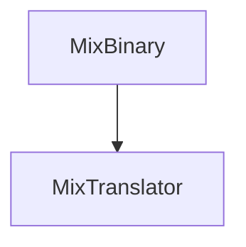

music mixing file. implemented with [[CapNProto]]

| [[type]]      | [[details]]     | [[ID]] | [[first]] | [[second]] | [[third]] | [[bar]] | [[beat]] | [[separate]] | [[Ebar]] | [[Ebeat]] | [[Eseparate]] |
| ------------- | --------------- | ------ | --------- | ---------- | --------- | ------- | -------- | ------------ | -------- | --------- | ------------- |
| [[TYPE_ENUM]] | [[DETAIL_ENUM]] | int    | TEXT      | TEXT       | TEXT      | long    | long     | long         | long     | long      | long          |

See: [[MixTranslator]]
"I" means it can get frame in only
"O" means it can get frame in-out only
"IO" means it can get frame in only, and in-out

| in-out | [[type]]        | [[ID]] | [[details]]                   | [[first]]            | [[second]]    | [[third]]          | when off |
| ------ | --------------- | ------ | ----------------------------- | -------------------- | ------------- | ------------------ | -------- |
| IO     | FILTER(0)       | ID     | HIGH(1)/LOW(3)                | value                | value(inter)  |                    | val<0    |
| IO     | EQ(1)           | ID     | HIGH(1)/MID(2)/LOW(3)         | value                | value(inter)  |                    | val<-60  |
| IO     | DISTORTION(2)   | ID     | 0                             | value                | value(inter)  |                    | val<0    |
| I      | CONTROL(3)      | ID     | //CUE(4)/ //PLAY(5)/ PAUSE(6) | approx_loc           | X             |                    |          |
| IO     | VOL(4)          | ID     | TRIM(7)/FADER(8)              | value                | value(inter)  |                    |          |
| I      | LOAD(5)         | ID     | 0                             | title                | composer      | bpm                |          |
| I      | UNLOAD(6)       | ID     | 0                             | X                    | X             |                    |          |
|        | //BEAT_MATCH(7) | ID     | WARP(0)                       | Master_approx_loc    |               |                    |          |
| I      | bpmControl(8)   | ID     | MASTER(10)/RAW(11)            | BPM(double)          |               |                    |          |
| O      | ECHO(9)         | ID     | 0                             | BPS                  | feedback(0~1) | power              | bps<0    |
| O      | LFO_Filter(10)  | ID     | 0                             | BPS                  | MIN_FREQ      | power              | bps<0    |
| O      | FLANGER(11)     | ID     | 0                             | BPS                  | GAIN          | power              | bps<0    |
| O      | PHASER(12)      | ID     | 0                             | BPS                  | GAIN          | power              | bps<0    |
| O      | TRANCE(13)      | ID     | 0                             | BPS                  | GAIN          | power              | bps<0    |
| O      | PANNER(14)      | ID     | 0                             | BPS                  | GAIN          | power              | bps<0    |
| O      | BATTLE_DJ(15)   | ID     | SPIN(12)/BSPIN(13)/REV(14)    | SPEED                |               |                    |          |
| I      | BATTLE_DJ(15)   | ID     | SCRATCH(15)/BSCRATCH(16)      | SCR_entry_approx_loc | SPEED         | SCR_out_approx_loc |          |
| X      |                 | ID     |                               |                      |               |                    |          |
| O      | ROLL(16)        | ID     | 0                             | BPM                  | power         | X                  |          |