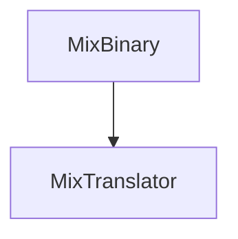

music mixing file. implemented with [[CapNProto]]

| [[type]]      | [[details]]     | [[ID]] | [[first]] | [[second]] | [[third]] | [[bar]] | [[beat]] | [[separate]] | [[Ebar]] | [[Ebeat]] | [[Eseparate]] |
| ------------- | --------------- | ------ | --------- | ---------- | --------- | ------- | -------- | ------------ | -------- | --------- | ------------- |
| [[TYPE_ENUM]] | [[DETAIL_ENUM]] | int    | TEXT      | TEXT       | TEXT      | long    | long     | long         | long     | long      | long          |

See: [[MixTranslator]]
"I" means it can get frame in only
"O" means it can get frame in-out only
"IO" means it can get frame in only, and in-out

| in-out | [[type]]       | [[ID]] | [[details]]                            | [[first]]     | [[second]]       | [[third]]                      | Interpolated Value |
| ------ | -------------- | ------ | -------------------------------------- | ------------- | ---------------- | ------------------------------ | ------------------ |
| O      | FILTER(0)      | ID     | HIGH(0)/LOW(2)                         | [[ITPL]]      | [[8PointValues]] |                                | filter Frequency   |
| IO     | EQ(1)          | ID     | HIGH(0)/MID(1)/LOW(2)                  | [[ITPL]]      | [[8PointValues]] |                                | eq value           |
| IO     | DISTORTION(2)  | ID     | 0                                      | [[ITPL]]      | [[8PointValues]] |                                | drive  value       |
| I      | CONTROL(3)     | ID     | PAUSE(3)/CUE(4)                        | approx_loc    | X                |                                |                    |
| IO     | VOL(4)         | ID     | TRIM(7)/FADER(8)                       | [[ITPL]]      | [[8PointValues]] |                                | volume             |
| I      | LOAD(5)        | ID     | 0                                      | title         | composer         | bpm                            |                    |
| I      | UNLOAD(6)      | ID     | 0                                      | X             | X                |                                |                    |
| I      | bpmControl(7)  | ID     | timeStretch(6)                         | BPM(double)   |                  |                                |                    |
| O      | ECHO(8)        | ID     | 0                                      | [[ITPL]]      | [[8PointValues]] | BPM, feedback                  | Wet amount         |
| O      | OCS_Filter(9)  | ID     | HIGH(0)/LOW(2)                         | [[ITPL]]      | [[8PointValues]] | BPM, MiddleFreq, RangeHalfFreq | Wet amount         |
| O      | FLANGER(10)    | ID     | 0                                      | [[ITPL]]      | [[8PointValues]] | BPM                            | Wet amount         |
| O      | PHASER(11)     | ID     | 0                                      | [[ITPL]]      | [[8PointValues]] | BPM                            | Wet amount         |
| O      | TRANCE(12)     | ID     | 0                                      | [[ITPL]]      | [[8PointValues]] | BPM,GAIN                       | Wet amount         |
| O      | PANNER(13)     | ID     | 0                                      | [[ITPL]]      | [[8PointValues]] | BPM,GAIN                       | Wet amount         |
| O      | BATTLE_DJ(14)  | ID     | [[SPIN]](12)/[[PITCH]](13)/[[REV]](14) | SPEED         |                  |                                |                    |
| I      | BATTLE_DJ(14)  | ID     | SCRATCH(15)                            | StartPosition | SPEED            |                                |                    |
| X      |                | ID     |                                        |               |                  |                                |                    |
| O      | ROLL(15)       | ID     | 0                                      | [[ITPL]]      | [[8PointValues]] | BPM                            | Wet amount         |
|        | COMPRESSOR(16) | ID     | 0                                      | Strength      | Thresh,Knee      | ATT,REL                        |                    |
|        | ROBOT(17)      | ID     | 0                                      | [[ITPL]]      | [[8PointValues]] | ocsFreq                        | Wet amount         |

SPEED: -N ~ N (float) 1 Equals 100%, -1.0 Equals -100%(reverse play), 10.0 Equals 1000%. Based on BPM before time stretching.
