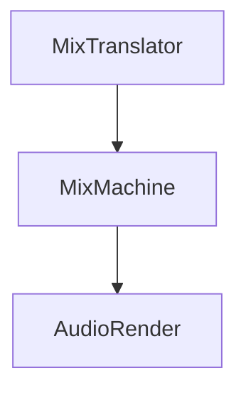

Mixes music using translated [[MixBinary]] 
Output is [Audio PCM frames](https://en.wikipedia.org/wiki/Pulse-code_modulation).
We use the Float32 type to represent PCM frames.

Sequence:
1. **Load Memory** : Use Load and Unload to determine the size of memory to contain.
2. **Cut Music**:  Cut music with Pause data
3. **Battle DJ**: Applies all phenomena that occur in Battle DJ.
4. **EQ AND EFFECT**: Apply EQ and EFFECT data.
5. **Volume Controls**: Apply things related to volume such as Trim and Fader.
6. **Change Bpm**: Change Speed of music. and the speed is adjusted using the [[SOLA]] algorithm.

See: [[MixBinary]], [[MixTranslator]], [[Audio_Render]]