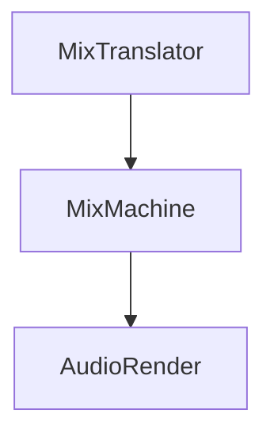

Mixes music using translated [[MixBinary]] 
Output is [Audio PCM frames](https://en.wikipedia.org/wiki/Pulse-code_modulation).
The amount returned depending on the type of [[Audio_Render]]
We uses float 32 type to express PCM frames.

See: [[MixBinary]], [[MixTranslator]], [[Audio_Render]]