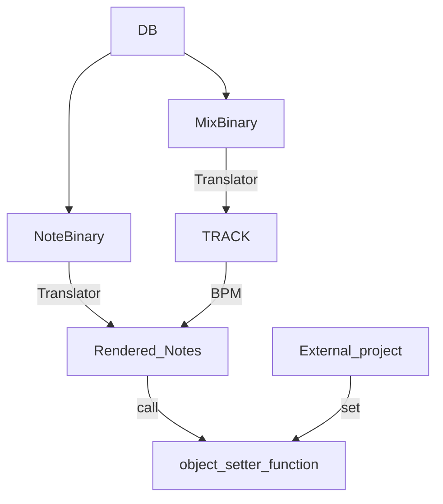

Note Render Process

```mermaid
flowchart TD
DB --> MixBinary
DB --> NoteBinary
MixBinary -->|Translator| TRACK
NoteBinary -->|Translator| Rendered_Notes
TRACK -->|BPM| Rendered_Notes
Rendered_Notes -->|call| object_setter_function
External_project -->|set| object_setter_function
```

See: [[NOTE_OBJ]], [[NoteBinary]], [[MixBinary]], [[DB]], [[Track]], [[object_setter_function]]

