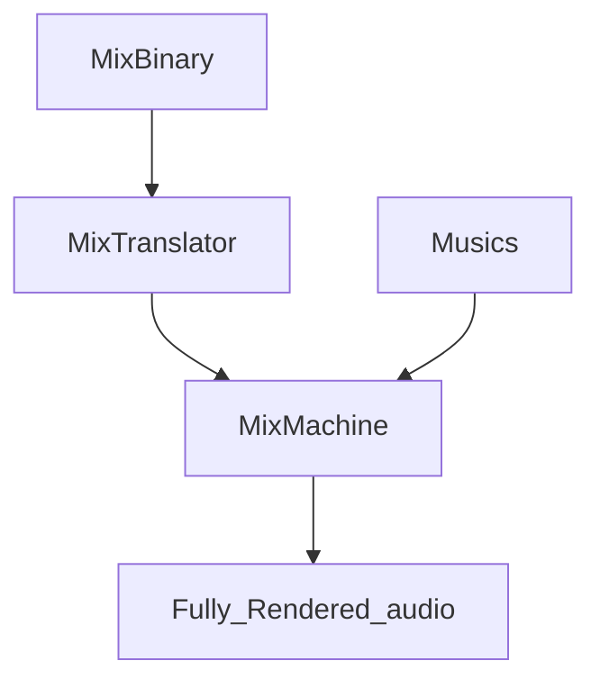

This Render process has to finish all mixing before the audio play.

It's set to default. If there are no changes in the middle of the audio play, you are more likely to use real-time performance.

See: [[MixBinary]], [[MixTranslator]], [[MixMachine]]
