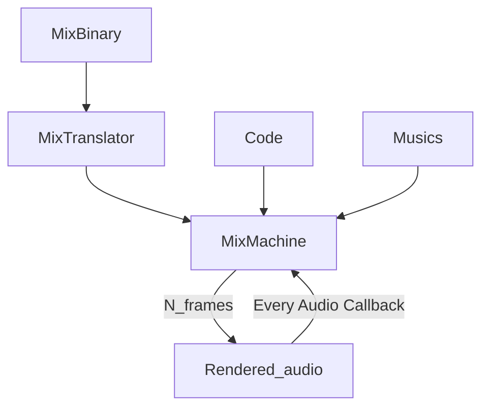

The difference between [[PreRender]] and [[RealTime_Render]] is that [[RealTime_Render]] generates and delivers only the necessary audio data in real-time during each audio callback.

You can also do additional Audio Mixing using code. If you want to change audio mixer in real time, this mode works.

See: [[MixBinary]], [[MixTranslator]], [[MixMachine]]